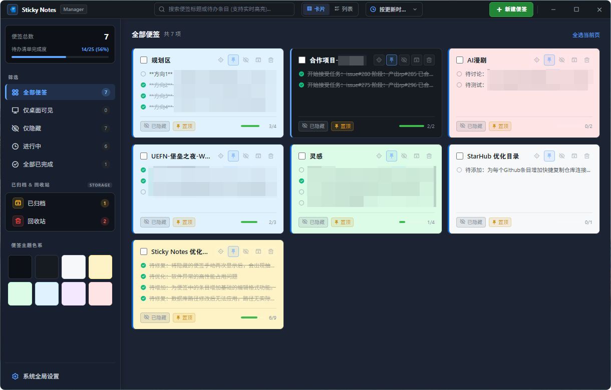
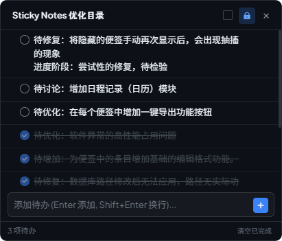
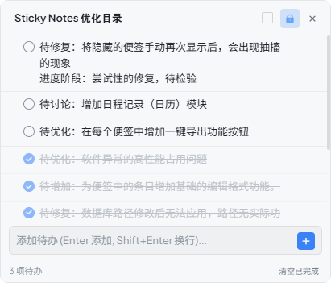
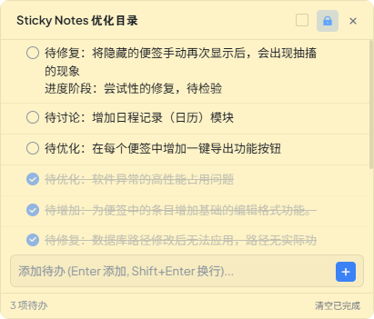
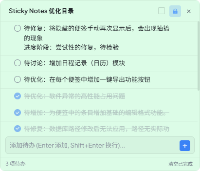
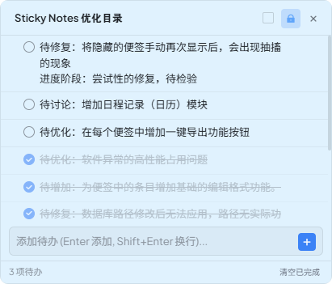
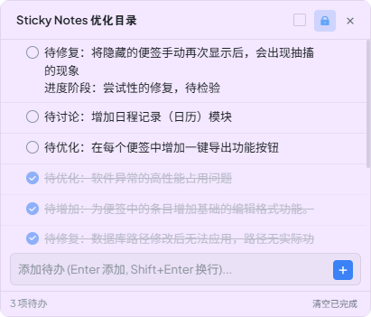
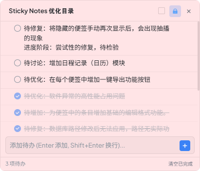

<p align="center">
  
</p>

<h2 align="center">Stickify</h2>
<p align="center">Windows 桌面便签 · 多维管理工作台</p>

<p align="center">
  <a href="https://github.com/EchoCreek/sticky_notes/releases"></a>
  
  
</p>

<br>

<p align="center">
  
</p>

<br>

---

Stickify 是一款 Windows 桌面便签软件。便签窗口常驻桌面，支持半透明、鼠标穿透和贴边隐藏；管理工作台独立打开，用于搜索、归档和批量操作多张便签。

---

## 管理工作台



卡片视图与紧凑表格视图可切换。左侧侧边栏汇总全局待办完成率。搜索栏支持实时全文检索，匹配词高亮。筛选栏可按状态（活动 / 隐藏 / 归档 / 回收站）或颜色筛选。

点击卡片右上角的定位按钮，对应便签窗口会激活并闪烁定位。侧边抽屉可直接修改便签标题、底色、置顶状态与透明度，并增删改待办子项。

---

## 便签配色

8 款内置底色，在便签右上角菜单中切换，底色变化时前景色自动适配明暗。

<table>
  <tr>
    <td align="center"><br><sub>曜石黑</sub></td>
    <td align="center"><br><sub>石墨灰</sub></td>
    <td align="center"><br><sub>极简白</sub></td>
    <td align="center"><br><sub>暖阳米</sub></td>
  </tr>
  <tr>
    <td align="center"><br><sub>抹茶绿</sub></td>
    <td align="center"><br><sub>冰川蓝</sub></td>
    <td align="center"><br><sub>丁香紫</sub></td>
    <td align="center"><br><sub>柔粉桃</sub></td>
  </tr>
</table>

---

## 快捷键

**全局快捷键**（可在设置中自定义录制）

| 快捷键 | 功能 |
| :--- | :--- |
| <kbd>Win</kbd> + <kbd>Alt</kbd> + <kbd>F8</kbd> | 新建便签 |
| <kbd>Win</kbd> + <kbd>Alt</kbd> + <kbd>F7</kbd> | 解除当前便签穿透，进入编辑 |
| <kbd>Win</kbd> + <kbd>Alt</kbd> + <kbd>F9</kbd> | 隐藏全部便签 |
| <kbd>Win</kbd> + <kbd>Alt</kbd> + <kbd>F10</kbd> | 显示全部便签 |

**便签内操作**

| 快捷键 | 功能 |
| :--- | :--- |
| <kbd>Enter</kbd> | 添加待办条目 |
| <kbd>Shift</kbd> + <kbd>Enter</kbd> | 输入框内换行 |
| <kbd>Esc</kbd> | 退出编辑 / 关闭弹窗 |

**文本编辑**（输入框或就地编辑状态下，再次按下可 Toggle 解除）

| 快捷键 | 效果 |
| :--- | :--- |
| <kbd>Ctrl</kbd> + <kbd>B</kbd> | **加粗** |
| <kbd>Ctrl</kbd> + <kbd>I</kbd> | *斜体* |
| <kbd>Ctrl</kbd> + <kbd>U</kbd> | <u>下划线</u> |
| <kbd>Ctrl</kbd> + <kbd>Shift</kbd> + <kbd>S</kbd> | ~~删除线~~ |

---

## 下载

前往 [Releases](https://github.com/EchoCreek/sticky_notes/releases) 下载：

| 文件 | 说明 |
| :--- | :--- |
| `Stickify.1.0.0.x64.portable.zip` | 便携版，解压即用，数据存放在程序目录 |
| `Stickify.1.0.0.x64.exe` | 安装版，自动建立快捷方式 |

**系统要求**：Windows 10 / 11 (x64)，依赖 Microsoft Edge WebView2 Runtime（大多数现代 Windows 已内置）。

---

## 本地构建

<details>
<summary>展开</summary>

**环境**
- Windows 10 / 11 (x64)
- Visual Studio 2022 Build Tools（含 C++ 桌面开发 + MFC 支持）
- Node.js ≥ 18，pnpm ≥ 8
- Inno Setup 6（可选，打包安装包时需要）

**前端**

```powershell
pnpm --dir themes/manager install && pnpm --dir themes/manager build
pnpm --dir themes/default install && pnpm --dir themes/default build
pnpm --dir themes/simple  install && pnpm --dir themes/simple  build
```

**C++ 编译**

```powershell
$msbuild = "C:\Program Files (x86)\Microsoft Visual Studio\2022\BuildTools\MSBuild\Current\Bin\amd64\MSBuild.exe"
& $msbuild "Notes\Notes.vcxproj" /p:Configuration=Release /p:Platform=x64 /t:Rebuild /m
```

MSBuild 编译完成后自动将前端产物与 `Notes.exe` 同步至 `x64\Release\`。

**测试**

```powershell
.\x64\Release\NotesTests.exe
```

**打包**

```powershell
& "scripts\package_portable.ps1"                                 # 便携版
& "C:\Program Files (x86)\Inno Setup 6\iscc.exe" setupx64.iss   # 安装包
```

</details>

---

## 致谢与许可

Fork 自 [imlinhanchao/sticky_notes](https://github.com/imlinhanchao/sticky_notes)，遵循 [Apache License 2.0](LICENSE) 开源。

原工程作者：[imlinhanchao](https://github.com/imlinhanchao)。完整版权声明与第三方组件引用见 [NOTICE](NOTICE)。
